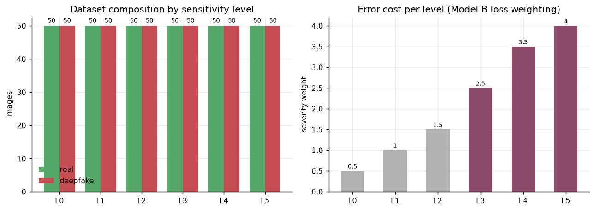
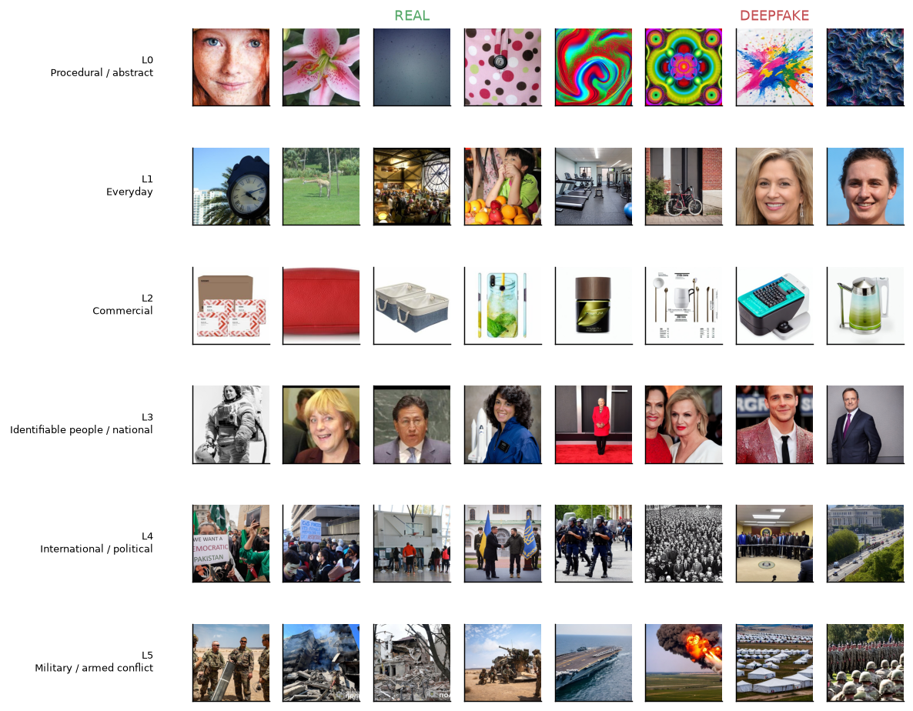
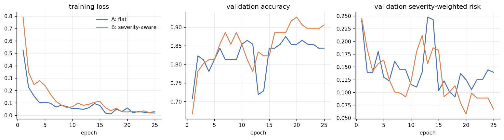
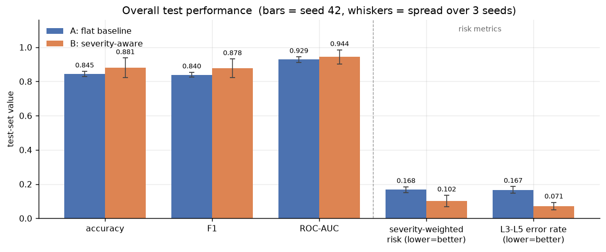
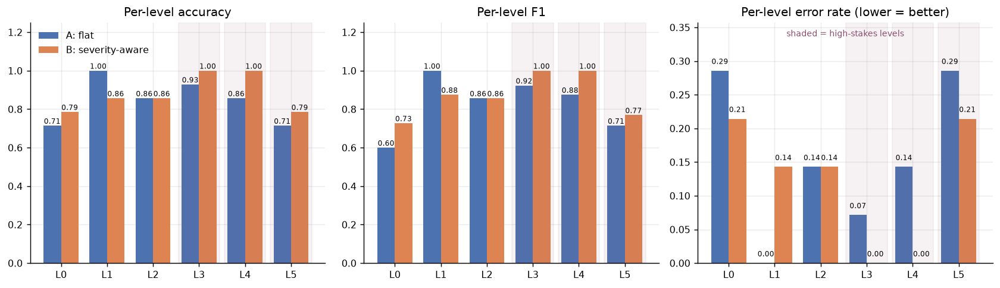
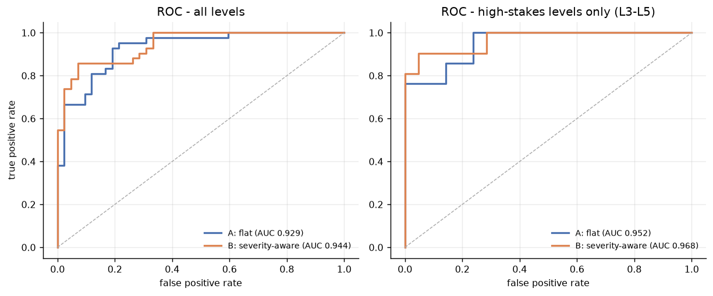
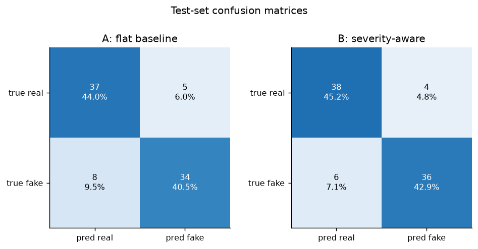
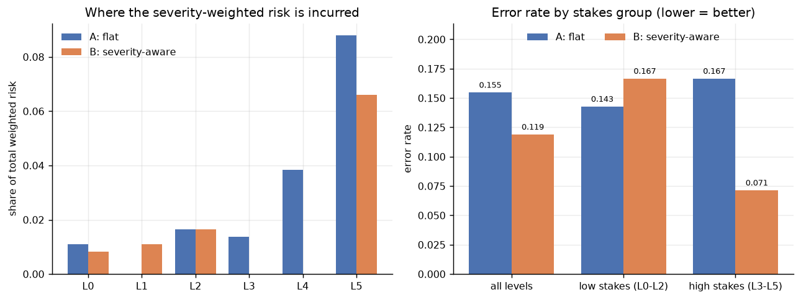
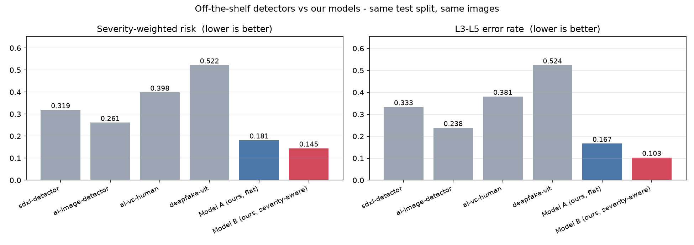

# Deepfake detection with sensitivity-level awareness
The project consist of creating a database on which to train a model able to recognise the original from the ai-created, but adding a "sensitivity" layer that keeps in count the impact that a fake image may have on the population. Therefore it was first created a sensitivity scale, created by the authors based on personal opinions. *Disclaimer:* the scale is heavily modelled on a journalist world perspective, due to one of the author passion for it and in general the opinion that deepfake works *as long as* media coverage uses it to depict the reality. Therefore it's not a neutral nor the only scale which could be used. The results may and most probably where influenced by this complex scale, and shall be taken as they are, *linked* to this scale. 
Also, satire was initially thought to be used also as a comparison, as deemed important in this case. However several factors including the lack of large database of it, the extreme regionalisation of the phenomena and the objective difficulties of the authors themselves in understanding many of the images. Smaller dataset may be found (i.e. reddit scraping) but to be useful regionalisation shall be made and this was harder then expected and therein excluded. AI was used, for code, but not entirely. Full AI usage and sources are listed down.

## Sensitivity levels

| level | meaning | real source | deepfake source | severity |
|---|---|---|---|---|
| L0 | procedural / abstract | Describable Textures Dataset | Bing Image Creator + Stable Diffusion 1.5 | 0.5 |
| L1 | everyday scenes and faces | COCO 2017 val (25) + FFHQ (25) | thispersondoesnotexist / StyleGAN2 (25) + SD 1.5 scenes (25) | 1.0 |
| L2 | commercial products | Amazon Berkeley Objects | SD 1.5 img2img seeded from the ABO photos | 1.5 |
| L3 | identifiable people | LFW (25) + Wikimedia Commons press photos (25) | SD 1.5 press-photo portraits | 2.5 |
| L4 | politics / international | Wikimedia Commons, CLIP-curated | SD 1.5 political scenes | 3.5 |
| L5 | armed conflict | Wikimedia Commons, CLIP-curated | SD 1.5 conflict scenes | 4.0 |

50 real + 50 deepfake per level. The severity column is the cost multiplier
applied to a classification error at that level.

## Pipeline

```bash
python scripts/01_collect_real.py           # real half + L4/L5 candidate pools
python scripts/02_curate_openfake.py        # CLIP-select the best 50 for L4/L5 real
python scripts/03_generate_fakes_sd.py      # synthetic half (Stable Diffusion 1.5)
python scripts/03_generate_fakes_sd.py L4   # political fakes (top-up set)
python scripts/04_topup_l1_fake.py          # StyleGAN2 faces for L1
python scripts/05_build_manifest.py         # normalise, label, split
python scripts/06_train.py --epochs 25      # train A, B and the ablation
python scripts/08_pretrained_baseline.py    # off-the-shelf detectors on our strata
```

`images/` holds the raw downloads and generations, one folder per level and
class (`L5Real`, `L5DeepFake`, ...). `dataset/images/` holds the normalised
copies that training actually reads, and `dataset_manifest.csv` the labels.

## Two design decisions worth knowing about

**Normalisation is not cosmetic.** The raw pool mixes 256px ABO thumbnails,
1024px StyleGAN PNGs and 512px diffusion output. The usage of different format and dimension was due the differences in creating the images. It's obvious that Wikimedia will have different images dimensions than for example unSplash API. A detector trained on that
pool can hit high accuracy by reading resolution and compression history rather
than synthesis artefacts. `05_build_manifest.py` centre-crops everything to a
square, resizes to 512 and re-encodes as JPEG q95, so every class shares one
encoding history. Accuracy may be impacted? Probably, perhaps possible, but avoiding this could have been worse.

**Content is matched within a level.** If L1's real half were only COCO scenes
and its fake half only GAN faces, the classifier would separate the classes on
"face vs scene". L1 is therefore 25 scenes + 25 faces on *both* sides, L2's
fakes are img2img renders seeded from the real ABO photos, and L5's fakes are
conflict scenes paired against real conflict photography. The database construction tried to use as much as possible different sources and NOT use Stable diffusion, trying to get "real" (or at least commercially available) deepfake. Also the insane weight of the stable diffusion was deemed a limit (Author's MacBook Air M2 almost melted during L3 stable diffusion) and therefore other work was done on the other author machine as deemed better, but still extremely heavy. Classification of the images (i.e labelling) was all handmade using the notebook machine internal script (which was used outside). 


Therefore Two consequences of that rule are worth spelling out:

* **L4/L5 real halves come from Wikimedia Commons, not OpenFake.** OpenFake's
  real half is LAION/ImageNet with free-text captions and no topic labels;
  keyword-matching those captions returned fashion shots (`tank` also matches
  "tank top") and oil portraits (`military attire`) as often as war reporting.
  `02_curate_openfake.py` pools candidates from Commons topic search *and* the
  OpenFake keyword matches, then keeps the 50 that CLIP scores highest against
  level-appropriate descriptions, rejecting near-duplicate frames of the same
  event. Commons wins almost every slot; the OpenFake political/military
  *fakes* turned out to be off-topic too, which is why L4's deepfakes are
  generated locally. OpenFake at the end created more problems than anything, and was deemed pretty much a stop more than a resource.
  
* **L3's real half is half LFW, half press photography.** LFW is 250x250, so
  after normalisation to 512 it is visibly soft while the synthetic half is
  natively sharp — a detector could separate them on blur alone. Author's personal photos were analysed to be used, but a combination of extreme resolution (even a normal iPhone picture is 24Mpx), HDR in almost all pictures, HEIC format as a nightmare, and the same faces repeated all over again made this a less appealing option.

## Labels

Every image carries its labels twice:

* **In the file.** EXIF `ImageDescription` holds a human-readable summary and
  `UserComment` a JSON blob with `level`, `label`, `is_fake`,
  `severity_weight`, `source` and `image_id`.
* **In `dataset_manifest.csv`.** Same fields plus the train/val/test split
  (stratified per level × class), original resolution, provenance path and a
  SHA-1 of the source file for duplicate detection.

Read them back with:

```python
from PIL import Image
import json
json.loads(Image.open("dataset/images/L5_fake_001.jpg").getexif()[0x9286])
```

## The two models

As requested, the model used was the same before and after the use of the sensibility scale. It was use a simple model since the bad experience on stable diffusion and the fear of excessive resource use on the machine.

Identical backbone (ResNet-18, ImageNet init), identical splits, identical
augmentation. The only difference is whether the level is used while training.

|  | Model A — flat | Model B — severity-aware |
|---|---|---|
| binary head | yes | yes |
| level supervision | none | auxiliary 6-way level head |
| loss weighting | uniform | per-sample severity weight |
| needs the level at inference | no | no |

Model B uses the category in two ways: each sample's binary loss is scaled by
its level's severity weight, and an auxiliary head has to predict the level
itself, which keeps category structure in the shared trunk. Both are used at
training time only — at inference Model B takes an image and nothing else, so
the comparison is like-for-like and the model stays deployable on unlabelled
input.

Two further variants isolate B's ingredients: **C** uses the weighted loss
alone, **D** the level head alone, so the report can say which half of the
category signal actually does the work.

The headline comparison metric is **severity-weighted risk**: the error rate
with every mistake priced by its level's weight. Every configuration is trained
with three seeds, because a ~90-image test split moves by a couple of points
between seeds on its own. Results, per-level breakdowns and all figures land in
`results/`.

## Benchmarking pre-trained detectors

Before our own models, the dataset is used the way a benchmark is meant to be
used: four public, off-the-shelf detectors are run on it zero-shot, stratified
by sensitivity level. Nothing is fine-tuned, and every checkpoint sees exactly
the images our models see -- same normalisation, same manifest, same splits.

| detector | ROC-AUC | severity-weighted risk | L3-L5 error |
|---|---|---|---|
| `haywoodsloan/ai-image-detector-deploy` (SwinV2) | 0.821 | 0.261 | 0.238 |
| `Organika/sdxl-detector` (SwinV2) | 0.753 | 0.319 | 0.333 |
| `Ateeqq/ai-vs-human-image-detector` (SigLIP) | 0.672 | 0.398 | 0.381 |
| `prithivMLmods/Deep-Fake-Detector-v2-Model` (ViT) | 0.422 | 0.522 | 0.524 |
| Model A (ours, flat) | 0.908 | 0.181 | 0.167 |
| Model B (ours, severity-aware) | 0.896 | **0.145** | **0.103** |

Test split, 84 images. Two operating points are reported for each checkpoint:
its own 0.5 threshold, and a threshold chosen on our train+val split. Ranking,
not calibration, is what separates them.

The face-specialised ViT sitting at chance is the point of a stratified
benchmark: a single accuracy number would have hidden the fact that it fails on
everything that is not a face. Per-detector scores, both operating points and
the per-level breakdown are in `results/pretrained_baseline.json`.

## Ethics

A sensitivity-aware detector is, by construction, a system that decides some
content deserves more scrutiny than other content. Three things follow, and we
would rather state them than let them be inferred.

**The taxonomy is policy, not measurement.** Our scale encodes a Western,
journalistic reading of harm. A model trained on it is most careful about what
*we* found alarming; a different scale would move that attention somewhere else.
Anyone reusing this should treat the level definitions as an editorial choice to
be argued with, not a property of the images.

**The error cost is asymmetric on purpose.** Pushing errors away from L5 means
accepting more of them at L1 -- the levels where ordinary people's photographs
live get the less careful model. That is a defensible trade for a newsroom or a
platform escalation queue, and it is not defensible as a silent default. Our L1
accuracy does drop under Model B, and the report says so.

**Flagging is one step from ranking.** A system that scores content by political
sensitivity is trivially repurposed into one that ranks or suppresses political
content. The severity head is a triage aid and belongs behind a human reviewer,
not in front of an automatic takedown. Nothing here should be used to make an
irreversible decision about a specific image or a specific person.

Finally, the synthetic imagery: it exists to train and evaluate a detector, it
depicts no real person, event or brand, and every generated file is marked as
synthetic in its EXIF.

## The 10 vs 12 category question
During the development, and image research, level 4 (International Danger) and 5 (military danger) were as we went more and more similar, especially in today perspective, Therefore L4 and L5 were basically fused (also, not so many fake war picture exist) and considered as almost the same. Different countries have different threshold for the use of force...

The brief lists ten categories — five levels, each split real/deepfake — with
L4 and L5 treated as roughly equivalent. Here they are kept apart, giving
twelve cells, because that is strictly more information: merging L4 and L5
afterwards is one line of code, whereas splitting them is not, and the
per-level table can then show whether political and conflict imagery actually
behave the same way or not.

## Note on the generated imagery

The synthetic images exist to train and evaluate a detector. They depict no
real person, no real event and no real brand; product prompts are generic
categories rather than trademarks, and portrait prompts specify fictional
subjects. Each generated file is marked as synthetic in its EXIF.

## Report figures



















## SOURCES, AI, DISCLAIMER

The AI was used mainly in code development, especially for tuning the stable diffusion (quite tricky) code and the model for recognition. 
It was obviously used for image generation, in particular the L0Deepfake some are made with bing image generator, but only a 30% (due to the author ban after high usage...)

Journalist sources:

For creating the scale:
From the New York Times:

https://www.nytimes.com/2026/05/21/us/spencer-pratt-ai-videos.html?searchResultPosition=36
https://www.nytimes.com/interactive/2025/06/29/business/ai-video-deepfake-google-veo-3-quiz.html
https://www.nytimes.com/2026/03/13/us/politics/ai-ads-campaign-deepfake.html
https://www.nytimes.com/video/opinion/100000006635241/deepfakes-adele-disinformation.html
https://www.nytimes.com/interactive/2025/06/29/business/ai-video-deepfake-google-veo-3-quiz.html

From the Wall Street Journal:

https://www.wsj.com/tech/ai-deepfake-nudes-bullying-school-d242b8d4

https://www.wsj.com/politics/elections/ai-deepfakes-are-getting-weirder-and-harder-to-spot-in-the-midterms-88b4f7ad

https://deloitte.wsj.com/sustainable-business/ais-deepfake-challenge-1b6ca04b

From Semafor:

https://www.semafor.com/article/10/24/2024/ai-deepfakes-should-be-a-concern-for-intelligence-agencies-worldwide-hive-ceo-says
https://www.semafor.com/article/01/28/2025/surge-in-deepfakes-heightens-fraud-risk-for-african-businesses

Also less used, Adam Tooze and his Chartbook newsletter, Joanna Stern (both WSJ and her newsletter).

